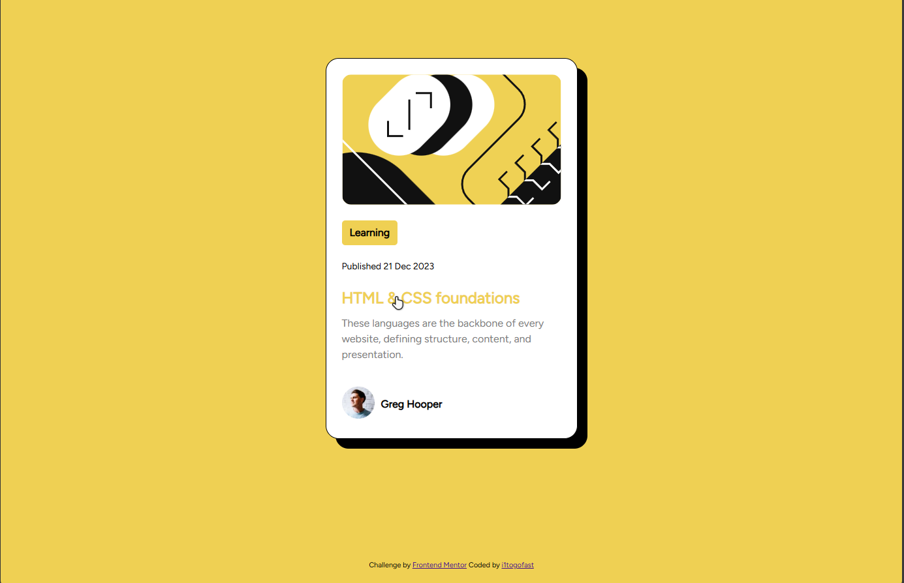
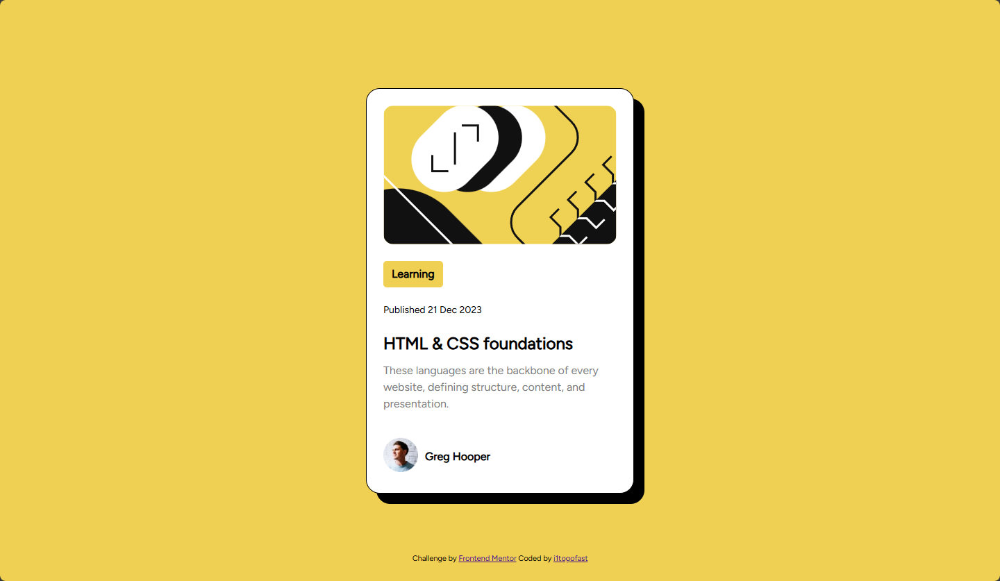

# Frontend Mentor - Blog preview card solution

This is a solution to the [Blog preview card challenge on Frontend Mentor](https://www.frontendmentor.io/challenges/blog-preview-card-ckPaj01IcS). Frontend Mentor challenges help you improve your coding skills by building realistic projects. 

## Table of contents

  - [Screenshot](#screenshot)
  - [Built with](#built-with)
  - [What I learned](#what-i-learned)
  - [Continued development](#continued-development)
  - [Useful resources](#useful-resources)
  - [Author](#author)

### Screenshot

   

### Built with

- Semantic HTML5 markup
- CSS custom properties
- Flexbox

### What I Learned

I continue to learn that i don't know s***.

### Continued development

I need more flexbox practice

### Useful resources

Google

## Author

- Frontend Mentor - [@i1togofast](https://www.frontendmentor.io/profile/i1togofast)

